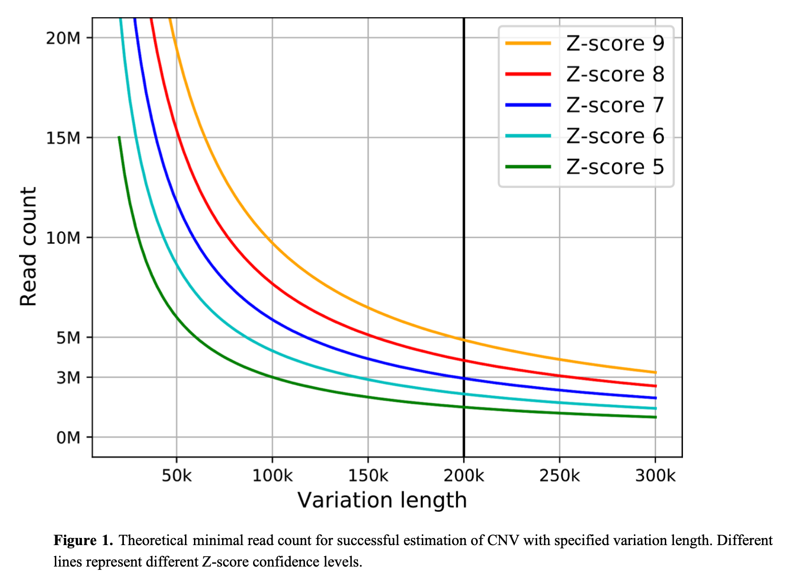
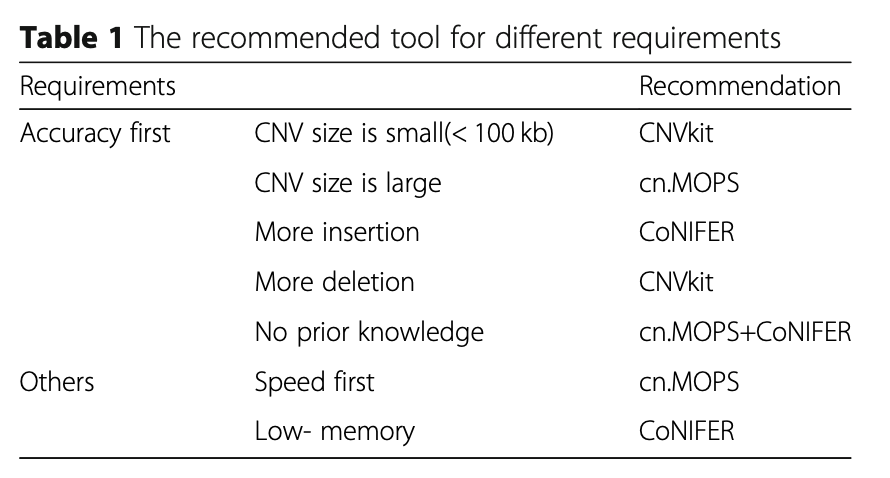

## low pass WGS

1.测序深度与CNV发现大小阈值,至少 6M uniquely mapped reads are required to detect CNV with a length of 100 kilobases (kb) or more with high confidence (Z-score > 7).  

  
 [Kucharik M, Budis J, Hyblova M, et al. Copy number variant detection with low-coverage whole-genome sequencing is a viable replacement for the traditional array-CGH[J]. medRxiv, 2020.](https://www.medrxiv.org/content/10.1101/2020.09.07.20183665v1)   
2.测序读长可以是50bp、75bp或者更长,pair-end read与 single read都可以，主要是counts数目，也就是reads数目，例如15 million reads and single-end 50 bp(equivalent to a read-depth of 0.25-fold)  
[Chau M H K, Wang H, Lai Y, et al. Low‑pass genome sequencing: a validated method in clinical cytogenetics[J]. Human Genetics, 2020.](https://link.springer.com/article/10.1007/s00439-020-02185-9)   
[Dong Z, Xie W, Chen H, et al. Copy‐number variants detection by low‐pass whole‐genome sequencing[J]. Current Protocols in Human Genetics, 2017, 94(1): 8.17. 1-8.17. 16.](https://currentprotocols.onlinelibrary.wiley.com/doi/10.1002/cphg.43)   
3.low pass WGS对于CNV的检测解析度有限，所以设置滑动窗口可以设置为：50kb  
4.研究表面对于小于3M的CNV解析精度78.57%,对于大于3M的精度可达到100%  
[Hyblova M, Harsanyova M, Nikulenkov-Grochova D, et al. Validation of Copy Number Variants Detection from Pregnant Plasma Using Low-Pass Whole-Genome Sequencing in Noninvasive Prenatal Testing-Like Settings[J]. Diagnostics, 2020, 10(8): 569.](https://www.mdpi.com/2075-4418/10/8/569)   
5.建议CNV发现阈值：deletions with FC <0.7 and duplications with FC >1.3 
[Brison N, Van Den Bogaert K, Dehaspe L, et al. Accuracy and clinical value of maternal incidental findings during noninvasive prenatal testing for fetal aneuploidies[J]. Genetics in Medicine, 2017, 19(3): 306-313.](https://www.nature.com/articles/gim2016113)   
6.一些软件对应的算法：CNVnator (read depth),BreakDancer (paired-end mapping),LUMPY and Manta (paired-end mapping and split reads),or Cortex (de novo assembly).  
7.软件选择  
  